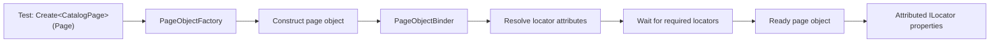
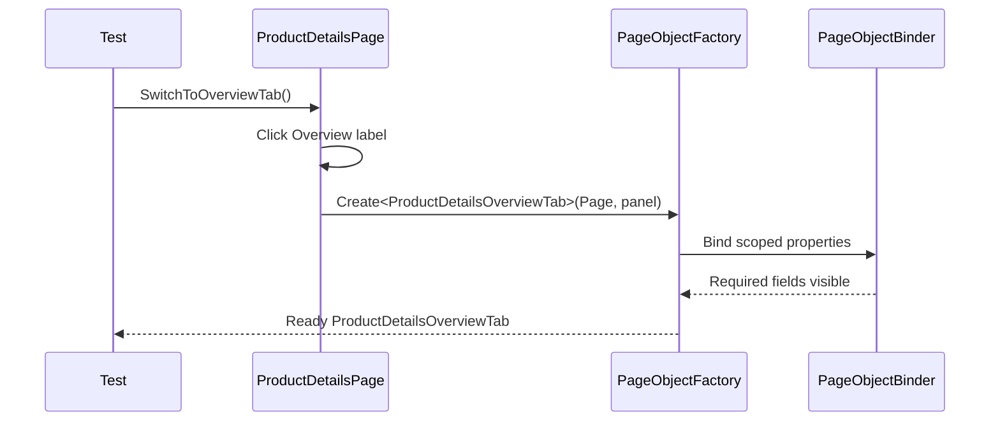

# POM V2 architecture

V2 is a separate xUnit v3 E2E project in `ShopDemo.sln`. It shares browser setup and demo data, but not page objects, with POM V1.

## From a test to a ready page object

`ShopDemo.Tests.E2E.Pom.V2.csproj` references `ShopDemo.Tests.E2E.Shared`. Tests inherit `ShopDemoPageTest` for the Playwright page and browser context options. They use `E2ETestSettings` and `DemoAccount` for shared test data. V2 does not reference POM V1 or use its `PomPages` wrapper.

The test asks `PageObjectFactory` for the object it needs. For example:

```csharp
var catalog = await new PageObjectFactory().Create<CatalogPage>(Page);
```

The factory constructs the object, then asks `PageObjectBinder` to bind its public UI properties. Page-object classes expose exactly one public constructor matching `(IPage page, ILocator? baseLocator = null)`.



Each auto-bound `ILocator` or nested `PageObject` property has exactly one `[DataTestId]` or `[Locator]` attribute. `[DataTestId("catalog-page")]` selects by test ID. `[Locator]` supports role, text, CSS, and XPath selectors. For example, `ShopNavigation.Bar` uses `[Locator(LocatorKind.Css, ".mud-appbar")]`; the locator strategy test exercises all four generic strategies.

Locators are required by default. The binder waits for required locators to become visible before returning the object. A missing or hidden required locator raises `PageObjectBindingException` with the object, property, and selector. `Required = false` still assigns the locator, but skips the initial wait and the readiness check.

`PageObject.IsReady()` returns `Task<bool>`. It checks the current visibility of required locators and required nested objects. It does not navigate or wait for an object to become ready.

## Scope, actions, and transitions

Without a base locator, attributes resolve against `IPage`. With a `BaseLocator`, they resolve inside that locator. Nested page objects receive the locator matched by their parent. For example, `ShopNavigation` binds `NavigationBar` to `.mud-appbar`, and the navigation links resolve inside that app bar. Tab objects use their active panel as the base locator.

Actions operate on the represented page or component. Examples include `CatalogPage.AddProductToCart`, `InventoryPage.UpdateStock`, and `CheckoutPage.PlaceOrder`. Transitions explicitly click a link or control, then return a newly created object for the resulting view. Examples include `NavigationBar.OpenCatalog` and `CartPage.ProceedToCheckout`. They do not navigate just to make an object ready.

## Product Details tabs

`ProductDetailsPage` owns tab activation. `SwitchToOverviewTab()` or `SwitchToInventoryTab()` clicks its tab label, selects that tab's panel locator, and creates the matching tab object with that panel as `BaseLocator`. The factory binds the tab's fields relative to the panel and waits for required fields before returning.



Overview exposes the product name, description, category, and price. Inventory exposes the product ID, stock, and availability. MudBlazor forwards unmatched `MudTabPanel` attributes to the panel (`role=tabpanel`), not the clickable tab. The stable tab test IDs are therefore on label spans inside the real tab controls; the journey test verifies each span is inside a `role=tab`.

## Tests and folders

- `PomJourneysTests` covers the four V1 journeys and a fifth journey that switches tabs and checks fields from both tab objects.
- `PageObjectFactoryTests` covers nested scope, role/text/CSS/XPath strategies, optional locators, readiness, required-binding errors, and unsupported constructors.
- `Infrastructure/` contains `PageObjectFactory`, `PageObjectBinder`, locator attributes and `LocatorKind`, the `PageObject` base, and `PageObjectBindingException`.
- `POM/` contains navigation and workflow page objects, plus `ProductDetailsPage`, `ProductDetailsOverviewTab`, and `ProductDetailsInventoryTab`.
- The project root contains the two test classes, project file, architecture plan, and this document.
